# SmartLEDLamp

A smart, web-enabled floor lamp with nice visual effects based on IKEA Vidja powered by ESP8266.
IR or http controlled.

# Looks like this (some examples):

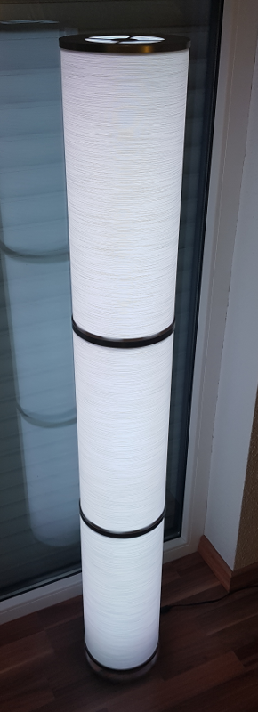 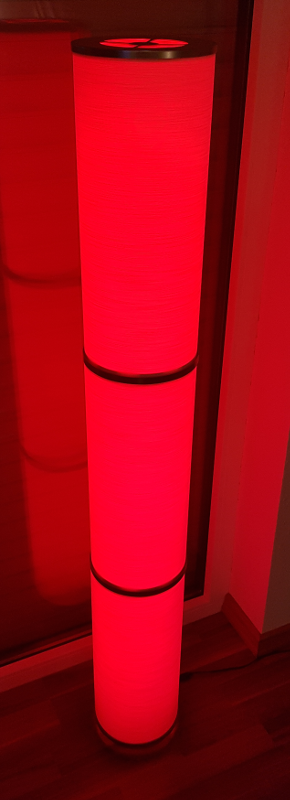 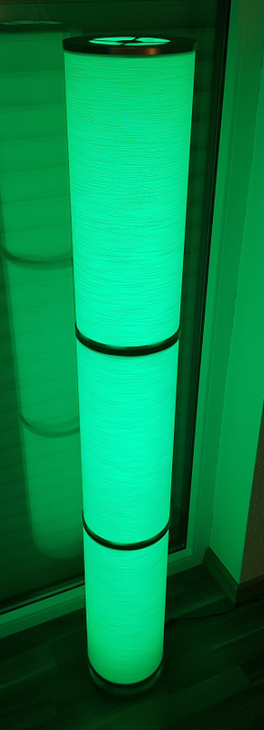 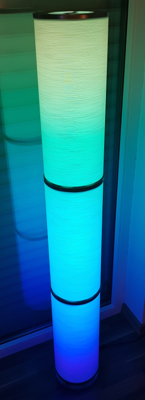 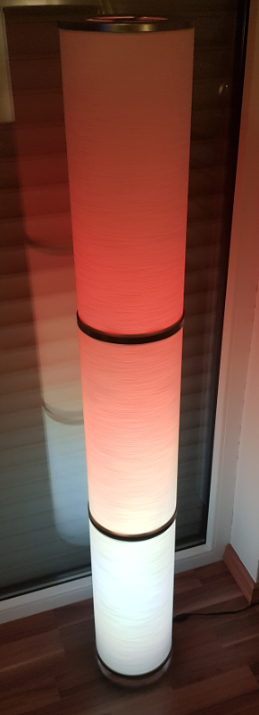 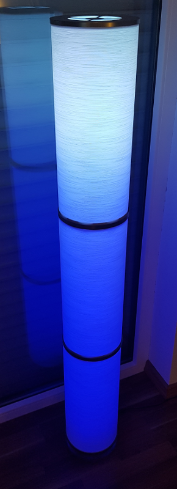 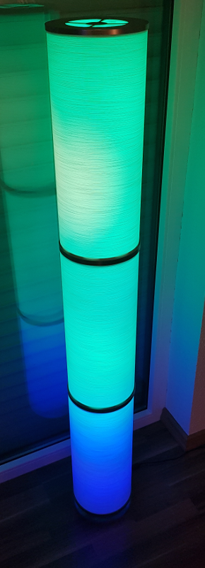 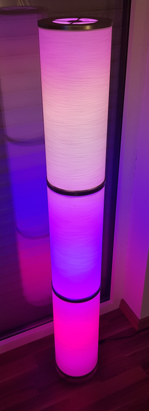 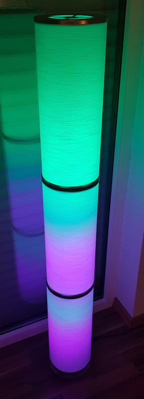 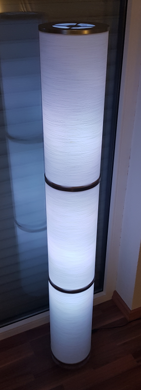

Animation example (fire)

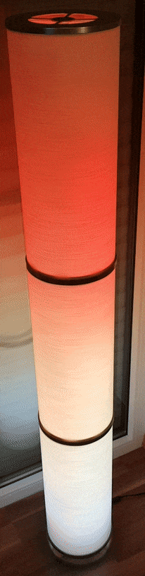


# Making of

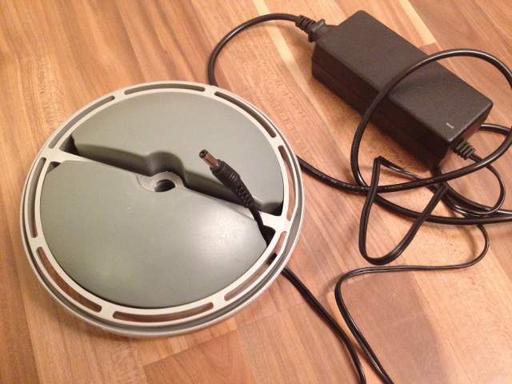 

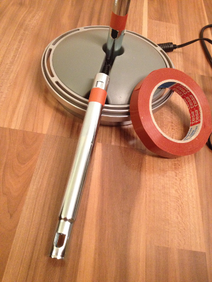 

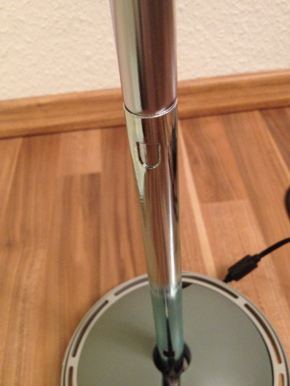  

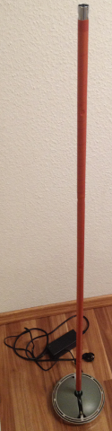

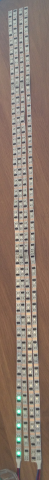

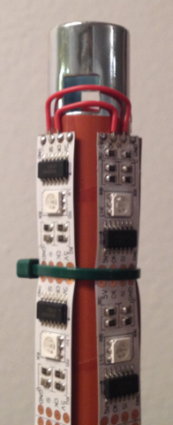

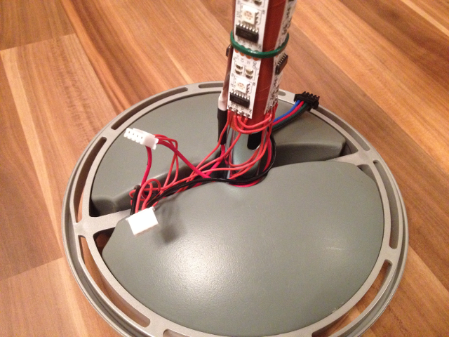

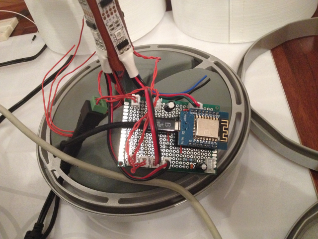

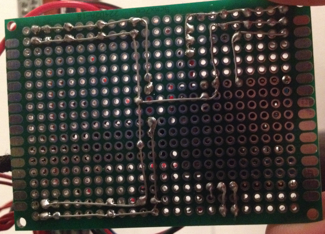

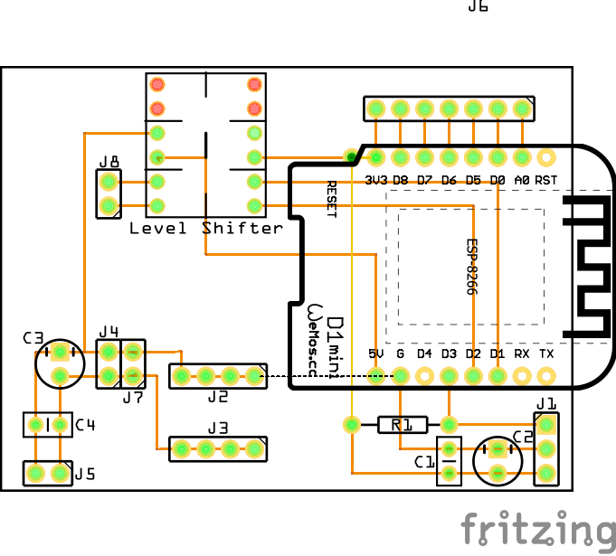


# Ingredients
* IKEA Vidja
* ESP8266 (Wemos D1 or a similar variant with 4MB flash memory)
* 5m WS2801 (160 LEDs)
* Power Supply 5V, 10A
* Cable straps, resistors, capacitors, duct tape, few hours spare time...
* (optional) IR Sensor (e.g. VS1838) plus Mini led controller 44 ([search aliexpress](https://de.aliexpress.com/wholesale?SearchText=remote+control+44))

# How to Build
* Make sure to use a memory layout with 3M SPIFFS
* The following libraries are needed:
  * From Arduino core for ESP8266:
    * ArduinoOTA
    * DNSServer
    * ESP8266mDNS
    * ESP8266WebServer
    * ESP8266WiFi
    * Hash
    * SPI
  * 3rd party:
    * ArduinoJson - https://github.com/bblanchon/ArduinoJson
    * ArtnetWifi - https://github.com/rstephan/ArtnetWifi (to use http://www.solderlab.de/index.php/software/glediator for example)
    * FastLED - https://github.com/FastLED/FastLED
    * IRemoteESP8266 - https://github.com/sebastienwarin/IRremoteESP8266
    * WebSockets - https://github.com/Links2004/arduinoWebSockets
    * WiFiManager - https://github.com/tzapu/WiFiManager
* Compile & upload

# First Start
* After initial upload ESP8266 is running in AP mode offering a WiFi AP connection called `SmartLEDLampAP`.
* Connect to that WiFi and open http://192.168.4.1 in your browser if it isn't shown automatically.
* Configure WiFi by supplying WiFi name plus password, save, wait a minute and restart the ESP8266.
* If connect data was right, ESP8266 is now accessible from your local network. IP is shown in the console as logging output:
  ```
  Info: Starting Smart LED Lamp
  Info: Free Sketch Space: 622592
  Info: No config file found, using defaults
  Info: IP: 192.168.0.110
  Info: HTTP server started
  Info: WebSocket server started
  ```
* Now build and upload SPIFFS. In folder SmartLEDLamp run
  ```
  mkspiffs -p 256 -b 8192 -s 3125248 -c data spiffs-image.bin
  ```
  and
  ```
  espota.py -i <IP> -s -f spiffs-image.bin
  ```
  Don't worry if the latter comes back with an error after upload.
* Alternatively you can use [ArduinoIDE Plugin for SPIFFS upload](https://github.com/esp8266/arduino-esp8266fs-plugin).
* Restart ESP8266

# Usage
* More often than not LED stripes won't be plain white when R, G and B are fully powered, thus you may want to calibrate your stripes. Go to http://&lt;IP&gt;/config.html to apply and save your calibration (Tip: this is done most easily turning on the lamp with fully brightness and white color.)
* You can access a web remote control page at http://&lt;IP&gt;/control.html to access a web control page showing the remote (please also refer to [data/rc.jpg](data/rc.jpg)) 
  * Most buttons are self-explaining. Here's just the special stuff:
    * 3rd button in the first row allows to start and stop animations
    * JUMP3 - Rainbow animation - Try QUICK/SLOW and the blue up/down arrows
    * JUMP7 - Fire animation - Try QUICK/SLOW, different up/down arrows (fire parameters), DIY1-6/AUTO (choose color palette)
    * FLUSH - FastLED noise animation - Try QUICK/SLOW, blue up/down arrows (scale), red up/down arrows (choose color palette) 
    * FADE3 - FastLED DemoReel animations - Try red up/down arrows
    * FADE7 - VU Meter - commented out in the code. You can run a microphone or line in on A0 of the ESP8266 to drive the VU Meter. You'll have to poke around with the code to make this work. Look for `readAnalogPeek` and the code calling it in `loop` in LEDLamp.cpp.
* Remote logging is available via port 8888. You could use PuTTY to connect to your lamp's IP, port 8888 using connection type raw and you will receive logging output like key presses and so on.

# Home Automation Integration
The following web API is available to integrate the SmartLEDLamp into OpenHAB for example:
```
http://<IP>/action/?act=on - Turn the lamp on
http://<IP>/action/?act=off - Turn the lamp off

http://<IP>/action/?btn=1 - Simulate press button 1
http://<IP>/action/?btn=17 - Simulate press button 17

http://<IP>/action/?brightness=17 - set brightness to 17%
http://<IP>/action/?brightness=100 - set brightness to 100%
```
